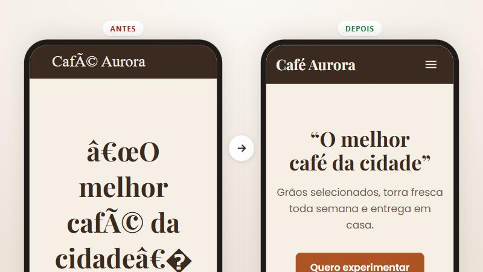

# Aprimorar design de site

Deixa um site que já existe mais bonito, mais rápido e mais agradável de usar — **sem mudar a cara dele**. E conserta sozinha letras e acentos quebrados.

<p align="center">
  
</p>

## O que ela faz

- **Mantém a identidade.** Usa as mesmas cores, fontes e estilo; quem já conhece o site reconhece na hora.
- **Melhora o visual.** Organiza, alinha, deixa a leitura mais fácil e faz o site funcionar bem no celular.
- **Anima com bom gosto.** Movimentos discretos que deixam o site mais agradável, sem exagero.
- **Deixa mais rápido.** A página carrega antes e para de "pular" enquanto abre.
- **Conserta texto quebrado.** Troca coisas como `Promoção` por `Promoção` e arruma fontes e ícones que não aparecem.
- **Explica sem poluir.** Quando uma função precisa de explicação, coloca um botão **?** ao lado em vez de um parágrafo.
- **Testa de verdade.** Olha o site no computador e no celular, clica, preenche formulários e compara o antes e o depois.

## Como usar

[Instale](../../README.md#como-instalar) e peça normalmente:

- *"melhora o visual do meu site"*
- *"meu site está com uns ç no lugar dos acentos, arruma"*
- *"deixa as animações mais suaves e o site mais rápido"*

No ChatGPT, envie o site compactado (`.zip`) junto com prints da tela do computador e do celular.

---

## Detalhes técnicos

### Fluxo

1. **DNA visual** — extrai paleta, tipografia, escala de espaçamento, raios e sombras. Toda mudança deriva disso; se o projeto não tem tokens, os valores repetidos viram variáveis CSS.
2. **Análise e teste de uso** — screenshots em ~1440px e ~375px, navegação como visitante (menus, formulários com dados de teste, teclado), console e o diagnóstico de navegador nas duas larguras.
3. **Correções automáticas** — roda o auditor com `--fix`; o que exige julgamento (caractere perdido, fonte ausente) é resolvido em seguida.
4. **Melhorias por prioridade** — design (hierarquia, escala, contraste WCAG AA, estados, responsivo), animações (150–300 ms, só `transform`/`opacity`, `prefers-reduced-motion`) e performance (imagens, fontes, scripts, CLS).
5. **Verificação** — repete a análise, compara antes e depois e entrega um resumo curto do que mudou.

### Auditor estático — `scripts/auditar.mjs`

```bash
node scripts/auditar.mjs <pasta-do-site>         # relatório
node scripts/auditar.mjs <pasta-do-site> --fix   # aplica as correções seguras
```

Node 18+, sem dependências. Ignora `node_modules`, `dist`, `build` e arquivos minificados; desconsidera código comentado.

**Corrige sozinho:**
- mojibake UTF-8 lido como Windows-1252, inclusive codificação dupla e bytes perdidos no caminho (`â€` → `”`, `à s` → `às`) — só troca sequências que formam UTF-8 válido, então texto correto (maiúsculas acentuadas, espanhol, francês, símbolos) não é alterado;
- arquivos salvos em Latin-1 → UTF-8; `<meta charset>` ausente ou diferente de UTF-8;
- `display=swap` no Google Fonts, `font-display` no `@font-face` e fonte genérica de reserva no `font-family` (serif, sans-serif ou monospace conforme a família).

**Aponta para revisão:** `�` com o trecho ao redor, fontes usadas mas nunca carregadas, arquivos de fonte inexistentes, bibliotecas de ícones não carregadas, scripts bloqueando a renderização, imagens sem dimensões ou pesadas, `transition: all`, animações de propriedades de layout e ausência de `prefers-reduced-motion`.

### Diagnóstico no navegador — `scripts/verificar-navegador.js`

Roda na página já renderizada (console, `page.evaluate` do Playwright ou qualquer ferramenta que execute JS) e pega o que a análise estática não vê:

- texto quebrado vindo de API ou banco de dados;
- fontes que não renderizam de fato (medição em canvas) e ícones que viraram texto;
- imagens quebradas ou muito maiores que o tamanho exibido;
- elementos causando rolagem horizontal, inclusive invisíveis;
- alvos de toque menores que 24 × 24 px e contraste abaixo do WCAG AA;
- TTFB, LCP, CLS, número de requisições e os recursos mais pesados.

### Botão "?" — `assets/ajuda-tooltip.html`

HTML, CSS e JS sem dependências, fáceis de transformar em componente. `button` com `aria-describedby` apontando para um `role="tooltip"`; abre com mouse, foco do teclado e toque, fecha com Esc ou clique fora; reposiciona o balão para não sair da tela; área de toque de 24 px ou mais; fica fora do layout quando fechado (não cria rolagem lateral); respeita `prefers-reduced-motion`.

### Exemplo

[`exemplos/aprimorar-design-site`](../../exemplos/aprimorar-design-site) traz um site propositalmente quebrado (`antes`) e o resultado da skill (`depois`).

### Limitações

- O auditor precisa do Node 18+. Sem ele, a IA aplica as mesmas regras manualmente.
- No ChatGPT, a análise visual depende dos prints e do diagnóstico que você cola no console — ele não vê o site rodando.
